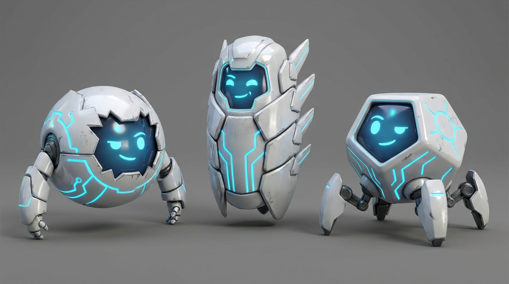

# AI Models



A collection of language model experiments built from scratch — each one exploring a different
technique, architecture, or dataset.

The goal is hands-on understanding: no pre-built pipelines, just raw implementation, training,
and deployment.

> All content is suspect — this repo is created by someone who knows nothing... yet.

---

## Models

### [001 — StackCT Help](models/001_stackct_help/)

**Technique:** GPT-style causal transformer built from scratch with PyTorch

**Data:** [STACK](https://www.stackct.com) construction estimating platform support knowledge base,
retrieved via the Zendesk Help Center API.

**Architecture:**

| Hyperparameter   | Value        |
|------------------|--------------|
| Embedding dim    | 256          |
| Context length   | 128 tokens   |
| Attention heads  | 8            |
| Transformer layers | 6          |
| Parameters       | ~5.8M        |
| Vocabulary size  | ~2,000 tokens |

**Reference:**
**[Building a Small Language Model from Scratch](https://medium.com/@rajasami408/building-a-small-language-model-from-scratch-a-practical-guide-to-domain-specific-ai-59539131437f)**
by Abdul Sami.

---

## Getting Started

### Model 001 — StackCT Help

```bash
cd models/001_stackct_help
```

**1. Create the virtual environment**

```bash
python3.12 -m venv .venv
.venv/bin/pip install -r requirements.txt
```

**2. Retrieve training data**

```bash
make retrieve
```

Fetches all articles from the STACK support site and writes them to `gen/training.txt`.

**3. Train the model**

```bash
make train
```

Trains for 10,000 steps (~35 passes through the data). Checkpoints saved to `gen/` every
1,000 steps.

**4. Chat with the model directly**

```bash
make generate
```

Interactive REPL — type a question, get a response. Type `quit` to exit.

**5. Convert to GGUF for Ollama**

```bash
make convert
make ollama-load
make ollama-run
```

Exports to `gen/model.gguf` and registers with Ollama for chat.

**Full Makefile reference** is in [`models/001_stackct_help/README.md`](models/001_stackct_help/README.md).

---

## Deployment Target

All models are built to run on a Raspberry Pi cluster using the
**Raspberry Pi AI HAT+ 2** (Hailo-10H, 10 TOPS).
